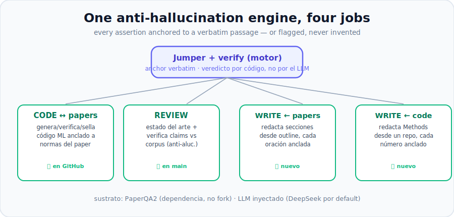
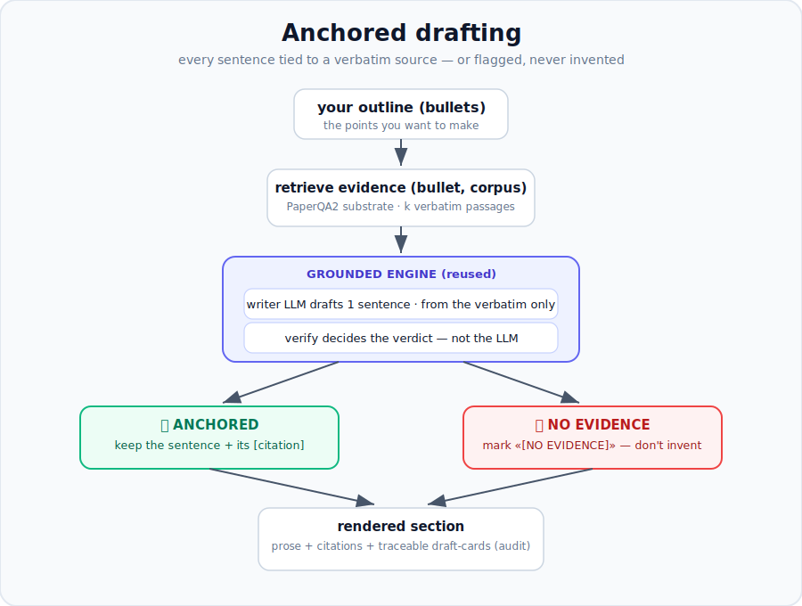

<div align="center">

# RAG-Research

### Your LLM keeps "reproducing" papers wrong. RAG-Research catches it — line by line, traceable to the passage that says so.

[](LICENSE)
[](pyproject.toml)
[](#honest-status)
[](https://github.com/Future-House/paper-qa)

</div>

---

You asked your LLM to implement a method from a paper. It used `batch_size=8`. You asked again
next week — it forgot. It dropped the intensity jitter into the **training** loop when the paper
clearly said **eval only**. The Dice score still looks fine. The reproduction is quietly broken,
and you won't find out until a reviewer does.

Here's the real problem: those norms never lived anywhere solid. They lived in the model's head —
and the model's head resets every session.

**RAG-Research pins them down.** It reads the paper, turns each reproducibility rule into a typed,
verbatim-anchored *spec-card*, then checks your code against it — every constraint traceable to the
exact passage that demands it. Hard numbers (`batch_size`, `lr`) are checked by **code, not
vibes**. Only the genuinely fuzzy stuff — *did the augmentation run in the right phase?* — goes to
an LLM. There's no "looks good to me" holistic judge, because that hand-wave is the exact failure
it exists to kill.

> It's not another "chat with your PDF." It's a **reviewer for reproducibility and research
> writing, grounded in the evidence.**

## What this is — and isn't

**It's a reviewer, not a ghostwriter.** You do the research and the writing. RAG-Research checks
every claim, number and method against the paper or your code, and tells you — traceably — where
you've drifted. It *can* help you draft, but only anchored to evidence, and it **flags what it
can't support instead of inventing it.** The point is to keep you honest, not to write your paper
for you.

## Four jobs, one engine

The same core — a verbatim **anchor** plus a verdict decided by **code, not the LLM** — powers
four review jobs. Each one refuses to assert anything it can't trace back to a source passage or a
real line of your code.

<div align="center">

</div>

| Job | What it does for you | How |
|---|---|---|
| **Check code ↔ paper** | flags where your ML code stops honoring the paper's reproducibility norms; stamps it so drift surfaces next session | ✅ CLI / MCP |
| **Review a manuscript** | builds the state of the art and verifies your claims against the corpus; flags the unsupported ones | ✅ `/review-paper`, `/review-consistency`, `/review-venue`, `/review-rewrite` |
| **Draft, anchored** | helps you write a section from your outline, with every sentence tied to evidence — and the unsupported bullets marked, not faked | ✅ `/write-section` |
| **Methods ↔ code** | drafts/checks your Methods against the repo, every number pinned to a real code line; mismatches flagged | ✅ `/write-methods` |

It replicates papers (pull a paper, get the evidence, draft ablations on top) and grounds your
writing in code — but the through-line is the same: **anchored or flagged, never invented.**

### Drafting that can't hallucinate

The drafting jobs are the inverse of review: instead of checking a claim you wrote, they help you
write one that's *already* anchored. For each outline bullet (or code aspect) the tool retrieves
the evidence, drafts one sentence grounded **only** in the verbatim source, then re-runs the
verifier — the sentence survives only if it earns an anchor. Bullets with no support come back
marked `[NO EVIDENCE]`. You stay the author; the tool just refuses to let an unsupported sentence
through.

<div align="center">

</div>

The rest of this README deep-dives the **code ↔ paper** check — the original engine.

## See it catch the bug everyone ships

```python
# the paper: "intensity jitter applied only at evaluation"
for x, y in train_loader:
    x = intensity_jitter(x, 0.1)   # ...applied during TRAINING
```

```text
$ rag-research verify card.json train.py
  [ ok  ] batch_size         honored    via deterministic
  [BLOCK] intensity_jitter   violated   via llm        <- wrong phase. caught.
  BLOCKED (exit 2)
```

Hard field, hard answer (code compared `8 == 8`). Fuzzy field, real judgment (the LLM saw jitter in
the train loop and blocked it). And every verdict points back to the verbatim line in the paper.

## "Don't Elicit / Consensus / Paper2Code already do this?"

No. Those tell you *what the literature says*, or generate a reproduction *once*. None of them
**stand guard over consistency** — that your code honors every norm, every time, traceably, and
that it gets flagged the moment a re-read of the paper changes one. That's the gap nobody fills.
That's RAG-Research.

## How it works

```
paper PDF ──▶ PaperQA2 substrate ──▶ verbatim passages
                                        │
                     extract (N-way agreement + an independent read-back)
                                        ▼
                                  typed spec-card
                                        │
   your ML code ──────────────▶   verify   ──▶  HONORED · VIOLATED · MISSING · AMBIGUOUS
                                        │                                + version stamp
                       moat-critical + unverified card ──▶ escalate to a human
```

- **Hard verdicts never flip** between runs — code does the compare, not a sampler.
- **A semantic field** is judged by an LLM, and if it touches a make-or-break constraint on a card
  no human has signed off yet, a violation **escalates to you** instead of silently blocking.
  *Self-consistent isn't the same as verified.*
- **The version stamp** is the cross-session memory: re-extract a card, change a value, and last
  week's code lights up **STALE** instead of drifting in the dark.

## 60-second start

```bash
pip install "rag-research[paperqa] @ git+https://github.com/RodMed0709/RAG-Research.git"

# bring your own LLM key — DeepSeek by default, any LiteLLM model works
echo "DEEPSEEK_API_KEY=sk-your-own-key" > .env

rag-research verify card.json train.py        # exit 0 ok · 1 ask a human · 2 blocked
```

Retrieval runs **fully offline** on local embeddings. Only the semantic judge calls out — and it
calls *your* key, never a shipped one.

## Install it into Claude Code (plugin)

RAG-Research ships as a Claude Code plugin — review commands, the `agente-escritor` reviewer,
and an MCP server, all on Claude, the same way [superpowers](https://github.com/obra/superpowers)
installs.

```bash
# 1. install the Python package (the MCP server + CLI live here)
pip install "rag-research[mcp,paperqa] @ git+https://github.com/RodMed0709/RAG-Research.git"
```

```text
# 2. add the marketplace and install the plugin, inside Claude Code
/plugin marketplace add RodMed0709/RAG-Research
/plugin install rag-research
```

That wires up the slash-commands (`/review-paper`, `/review-consistency`, `/review-venue`,
`/review-rewrite`, `/write-section`, `/write-methods`), the `agente-escritor` agent, and the MCP
tools. Then just say: *"use RAG-Research to check this claim against the corpus."*

Prefer just the MCP server, no plugin? `claude mcp add RAG-Research -- python -m rag_research.mcp_server`.
MCP tools: `verify_code_against_card`, `verify_claim_against_corpus`, `check_consistency`,
`tier_papers`, `draft_section_tool`, `draft_methods_tool`, and more.

## Spec-cards (the one thing you author)

A card is a paper's reproducibility rules, typed. Write them by hand (see `examples/cards/`) or pull
them with the extraction pipeline. Sketch:

```json
{
  "card_id": "zhou2023thyroid::MedSAM-ft",
  "paper_ref": "zhou2023thyroid", "method": "MedSAM-ft", "version": 1,
  "fields": [
    {
      "name": "batch_size", "category": "hyperparameter",
      "value_kind": "numeric", "locator_kind": "literal",
      "value_spec": {"kind": "numeric", "equals": 8},
      "moat_critical": true,
      "jumper": {
        "pq_dockey": "zhou2023thyroid-pdf",
        "verbatim_text": "...trained with a batch size of 8 per GPU...",
        "anchor_phrase": "batch size of 8", "page_range": "pages 5-6"
      }
    }
  ]
}
```

## Kick the tires

Runnable demos in `examples/` (offline where they can be):

| Demo | What you'll see |
|---|---|
| `run_slice.py` | the three verdicts: block / pass / don't-block |
| `smoke_substrate.py` | ingest a real PDF, pull verbatim passages — offline |
| `smoke_llm.py` | a real LLM judging the jitter-phase bug |
| `smoke_full_llm.py` | the whole loop: PDF → extract → card → generate → verify → stamp |
| `run_stamp.py` | the stamp catching last-session's code going stale |

## Honest status

Alpha. A research tool, not a maintained product — **use it at your own risk.** What's solid and
covered by tests (133): the verify engine, the offline PaperQA2 substrate, extraction with
cross-checks, the version stamp, the typed card-builder, DeepSeek adapters, the CLI, the MCP
server, and all four review jobs — code↔paper check, manuscript review (claim-cards, tiering,
consistency, references, tracked-changes corrections), anchored drafting from papers, and
Methods↔code — every one on the same anchored-or-flagged guarantee.

**Honest caveat:** the anchored-or-flagged guarantee is enforced and unit-tested at the contract
level, but the full end-to-end run (live PaperQA2 + a real LLM over a real paper) hasn't been
validated yet — that's the next milestone. What's not here yet either: a REST face,
image-equation handling, and conditional (`applies_when`) logic. No promises I can't keep.

## Standing on shoulders

Built on **[PaperQA2](https://github.com/Future-House/paper-qa)** (FutureHouse, Apache-2.0) — a pip
dependency, not vendored. Please cite *arXiv:2409.13740*. Ideas borrowed from Contextual Retrieval
(Anthropic) and HyperPIE.

## License

Apache-2.0 — see [LICENSE](LICENSE) and [NOTICE](NOTICE). Cite it via [CITATION.cff](CITATION.cff).
